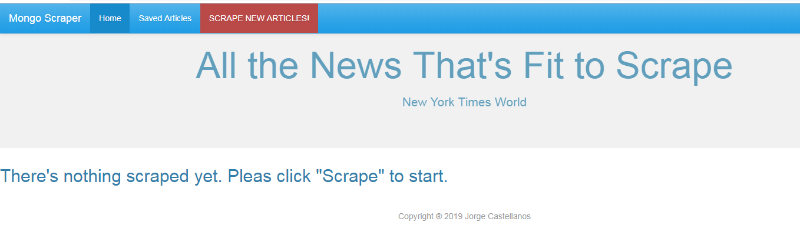
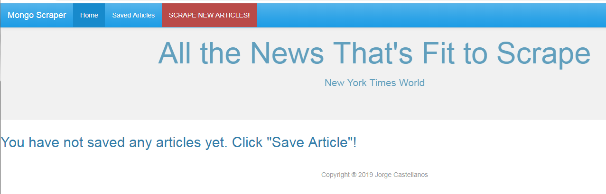
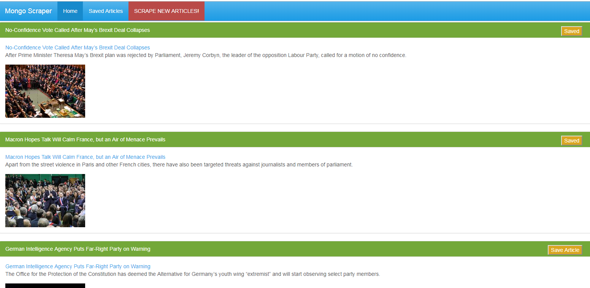
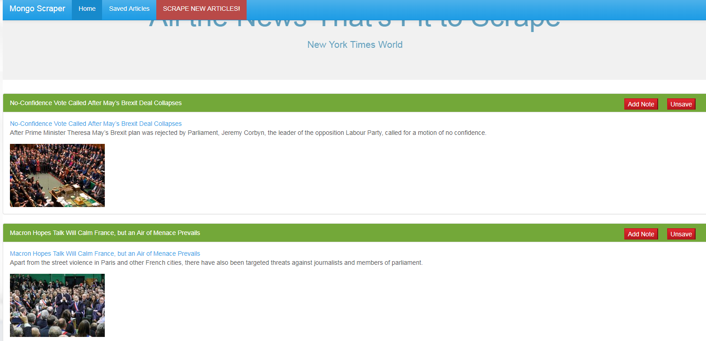
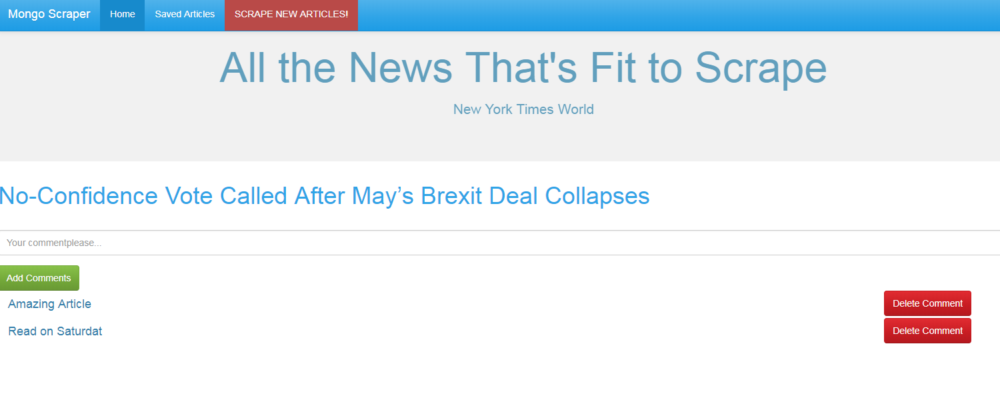
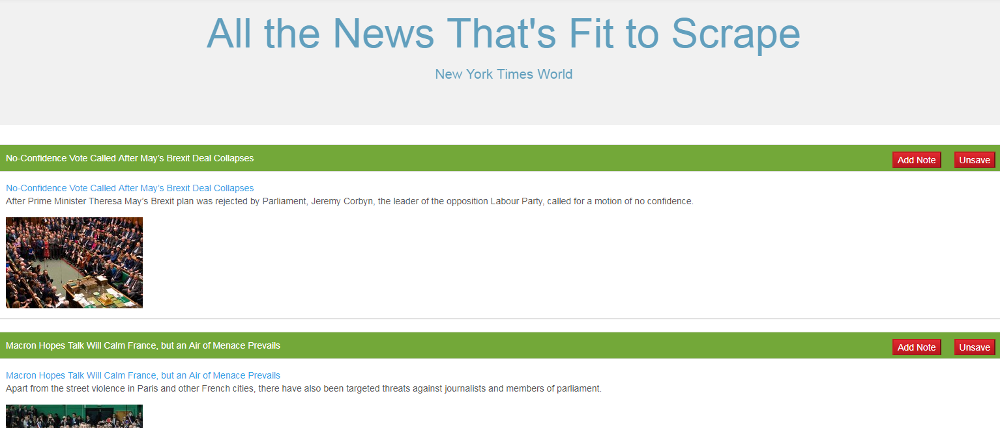
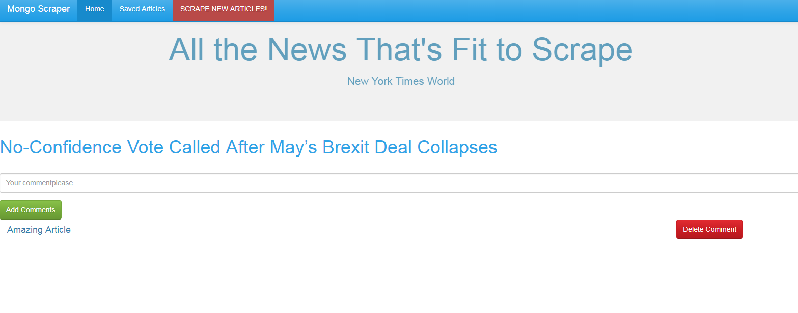

# scrape

https://immense-thicket-29215.herokuapp.com/

#portfolio
https://jorgecoder1234.github.io/portfolio/portfolio.html

#Display a message with no Articles scrape- You have to press "scrape new articles"

#display message a message of nothing is saved

#if you press "save article" the article is saved and you can see them in the saved section
#

#if you press "scrape new articles, you can see "the articles"

#if you press "add note" you can add comments to the Article

